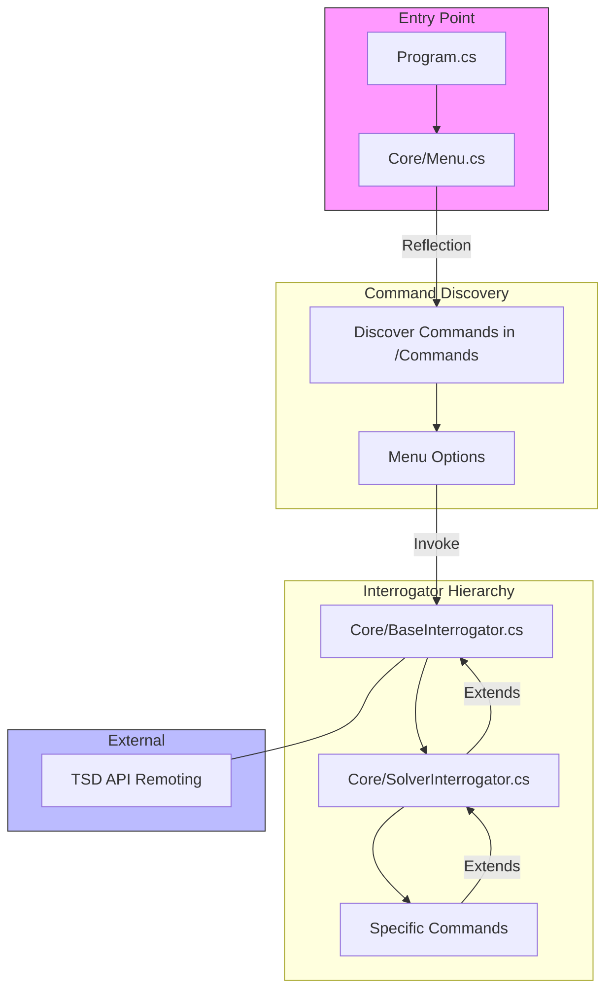
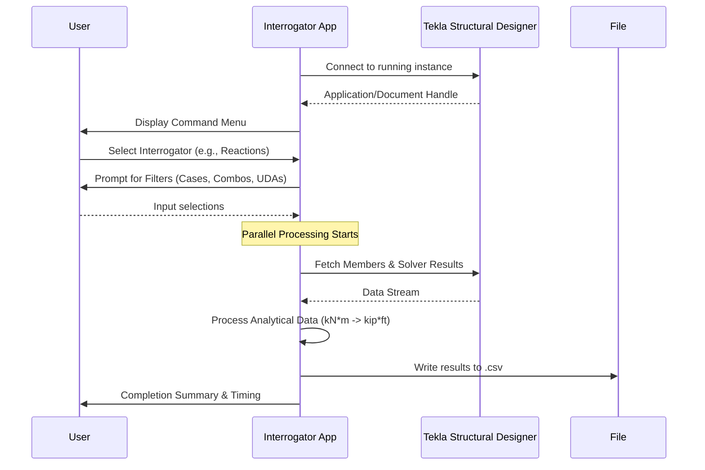

# TeklaResultsInterrogator

A powerful, high-performance console application designed to extract structural analysis results and design data from **Tekla Structural Designer (TSD)**. Built for structural engineers and developers, this tool bridges the gap between raw TSD analytical data and actionable formatted reporting.

## 🔍 Key Features

*   **Dynamic Command Discovery**: Automatically detects and loads new interrogation commands using C# Reflection.
*   **High Performance Extraction**: Utilizes `Parallel.ForEachAsync` with a `SemaphoreSlim` (ApiLimiter) to maximize throughput without overwhelming the TSD API.
*   **Comprehensive Interrogators**:
    *   [Steel Column Summary](Commands/SteelColumnSummary.cs): Extracts lifts, internal forces, eccentricity moments, and integrity forces.
    *   [Steel Column Forces](Commands/SteelColumnForces.cs): High-fidelity axial and shear force extraction at column stations.
    *   [Steel Column Envelopes](Commands/SteelColumnEnvelopes.cs): Extracts max/min axial forces, moments, and shears for all steel columns.
    *   [Steel Column Eccentricity Moments](Commands/SteelColumnEccentricityMoments.cs): Generates max/min envelope eccentricity moments for column lifts.
    *   [Steel Column Shortening](Commands/SteelColumnShortening.cs): Calculates axial shortening using the $PL/AE$ formula for each lift.
    *   [Steel Column Integrity Forces](Commands/SteelColumnIntegrityForces.cs): Extracts column tying/integrity forces for disproportionate collapse checks.
    *   [Steel Beam Forces](Commands/SteelBeamForces.cs): High-fidelity force extraction along beam spans.
    *   [Steel Brace Forces](Commands/SteelBraceForces.cs): Interrogates axial forces specifically for steel braces.
    *   [Reaction Summary](Commands/Reactions.cs): Global reaction extraction for all load cases and combinations.
    *   [Design Ratios](Commands/DesignRatios.cs): Extracts utilization ratios for Steel, Concrete, Timber, and Cold Formed members.
    *   [Footfall Analysis](Commands/FootfallAnalysis.cs): Specialized floor vibration reporting.
    *   [Timber Design](Commands/TimberBeamForces.cs): Specialized interrogators for timber member results (beams and columns).
*   **User-Centric Workflow**: Interactive command-line interface with intuitive prompts for filtering by loading conditions, UDAs, and member types.

---

## 🏗 System Architecture

The application is built on a modular "Interrogator" pattern, separating the core TSD connection logic from specific data extraction commands.



---

## 🔄 Interrogation Lifecycle

Typical execution flow from connection to report generation:



---

## 🛠 Getting Started

### Prerequisites
*   **Tekla Structural Designer** (Installed and Running)
*   An active TSD model open and **analyzed** (Results must exist for interrogation).
*   **.NET 8.0 Runtime** (or the version specified in the `.csproj`).

### Basic Usage
1.  **Open TSD**: Ensure your model is solved (1st Order Linear, P-Delta, etc.).
2.  **Launch**: Run `TeklaResultsInterrogator.exe`.
3.  **Command Menu**: Select a command by typing its name (e.g., `SteelColumnSummary`).
4.  **Follow Prompts**: Use numeric inputs or `Enter` for defaults when selecting loading conditions.
5.  **Output**: Results are saved in a subfolder named `ResultsInterrogator` relative to your `.tsmd` file.

---

## 👨‍💻 Developer Guide

### Adding a New Command
To add a new interrogation feature, create a new class in the `Commands` folder that inherits from `SolverInterrogator` or `BaseInterrogator`.

```csharp
public class MyNewCommand : SolverInterrogator
{
    public override bool ShowInMenu() => true;

    public override async Task ExecuteAsync()
    {
        await InitializeAsync(); // Connects to TSD and Model
        if (Flag) return;

        // Implementation logic here
        // ...
    }
}
```

### Performance Optimization
The codebase uses a specialized `ApiMetrics` class and `ApiLimiter` semaphore to manage TSD API calls.
*   `MaxDegreeOfParallelism`: Set to 16 by default to match API capabilities.
*   `ApiLimiter`: Prevents "convoy effect" stalls in parallel loops.

---

## ⚖ License
Created by **LeMessurier**. For internal use and professional structural engineering documentation.
